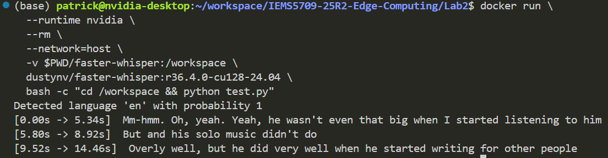
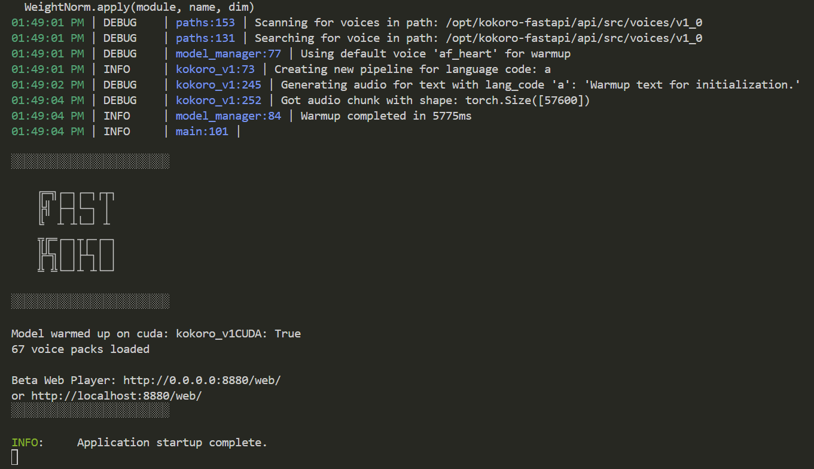

# Lab 2: Containerization of ASR & TTS Models

In lab 1, you have tried ASR and TTS models on the Jetson Orin. However, running these models on CPU is not efficient. In this lab, you will containerize the ASR and TTS models and run them on the Jetson Orin GPU. Follow the instructions below to have a try.

## ASR Model

For ASR, you will use the faster-whisper model. It is a reimplementation of the Whisper model that is faster and more efficient. The command below will start a container and run the test.py script to transcribe the audio file `faster-whisper/asr_en.wav`.

```bash
cd Lab2

docker run \
  --runtime nvidia \
  --rm \
  --network=host \
  -v $PWD/faster-whisper:/workspace \
  dustynv/faster-whisper:r36.4.0-cu128-24.04 \
  bash -c "cd /workspace && python test.py"
```

You can see the transcription result of `faster-whisper/asr_en.wav` in the terminal.



## TTS Server

For TTS, you will use the kokoro-tts model. It is a lightweight TTS model that only has 82M parameters. The commands below will start a container and provide TTS service on the port 8880. Then you can use `test.py` to try synthesize audio from text.

```bash

docker run -it \
  --runtime nvidia \
  --rm \
  -p 8880:8880 \
  dustynv/kokoro-tts:fastapi-r36.4.0-cu128-24.04

cd Lab2/kokoro-tts-fastapi
python test.py
```

After running the container, you should be able to see the following output:



After running the `test.py` script, the synthesized audio file is saved in `kokoro-tts-fastapi/kokoro-af_heart-fastapi.mp3`.

## Containerization

You can notice the difference between the two containers. The `kokoro-tts` provides a persistent service on the port 8880, while the `faster-whisper` only runs the transcribe process and then exits. In this lab, you will rebuild the `faster-whisper` container to provide a persistent transcription service similar to the `kokoro-tts` container. To achieve this, you need to write a new Dockerfile for the `faster-whisper` container, and provide a `api.py` script to handle the transcription request. As we will integrate ASR & TTS services in the next lab, you should build the api following the OpenAI API style so it is compatible for integration. An example of the OpenAI-compatible ASR request is as follows:

```bash
curl -X POST http://localhost:5092/v1/audio/transcriptions \
  -F "file=@asr_audio.wav" \
  -F "model=faster-whisper"
```

## References

https://github.com/dusty-nv/jetson-containers

https://github.com/dusty-nv/jetson-containers/tree/master/packages/speech/kokoro-tts/kokoro-tts-fastapi

https://github.com/dusty-nv/jetson-containers/tree/master/packages/speech/faster-whisper

# Submit Your Work

Read the [Assignment](Assignment.md) file for the submission instructions.