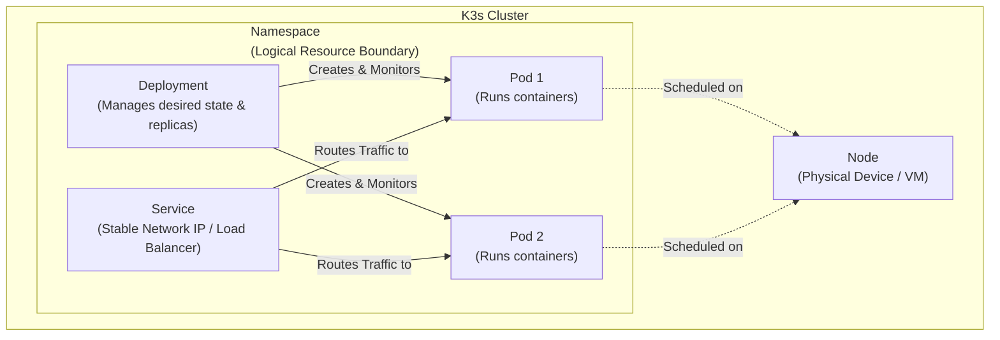

# Lab 4: Multi-Service AI Deployment with K3s

## Learning Objectives

By the end of this lab, you will be able to:

- Install and configure a single-node K3s cluster on Jetson Orin
- Use `kubectl` to inspect, deploy, and manage workloads
- Understand the five core Kubernetes objects: Pod, Deployment, Service, ConfigMap, PersistentVolumeClaim
- Deploy GPU workloads in K3s with the NVIDIA device plugin
- Migrate a Docker Compose stack to Kubernetes manifests

## Environment Notes

This lab runs on **NVIDIA Jetson Orin NX** with JetPack 6.x. Steps that differ on an Ubuntu workstation are marked:

- `[Jetson]` — Jetson Orin specific
- `[Workstation]` — Ubuntu x86-64 only
- *(no tag)* — works on both

---

## Part 1: Installing K3s

### What is K3s?

K3s is a lightweight, production-grade Kubernetes distribution from Rancher (SUSE). It packages the full Kubernetes API into a single ~70 MB binary, making it ideal for edge devices.

| | Docker Compose | K3s |
|---|---|---|
| Scope | Single machine | Cluster (1 to many nodes) |
| Self-healing | No (manual restart) | Yes (Deployment reconciles pods) |
| Service discovery | Container names | Kubernetes DNS |
| Scaling | Manual (`replicas:`) | `kubectl scale` / HPA |
| Production use | Dev / small deployments | Edge production |

### 1.1 Install K3s

**`[Workstation]`** — Basic install (no GPU):

```bash
curl -sfL https://get.k3s.io | sh -
```

**`[Jetson]`** — Install using system containerd so K3s inherits the NVIDIA runtime that JetPack already configured:

```bash
# JetPack's containerd already has the NVIDIA runtime set up.
# Tell K3s to use it via --container-runtime-endpoint.
curl -sfL https://get.k3s.io | INSTALL_K3S_EXEC="server \
  --container-runtime-endpoint unix:///run/containerd/containerd.sock" sh -
```

> Alternatively, run the helper script which also handles the NVIDIA device plugin:
> ```bash
> bash demo/02-gpu-workload/setup-gpu-runtime.sh
> ```

Wait ~30 seconds for K3s to start, then verify:

```bash
sudo systemctl status k3s
```

### 1.2 Configure kubectl Access

K3s writes a kubeconfig to `/etc/rancher/k3s/k3s.yaml`. Copy it to your home directory so you can run `kubectl` without `sudo`:

```bash
mkdir -p ~/.kube
sudo cp /etc/rancher/k3s/k3s.yaml ~/.kube/config
sudo chown $USER:$USER ~/.kube/config

echo 'export KUBECONFIG=~/.kube/config' >> ~/.bashrc
source ~/.bashrc
```

### 1.3 Verify the Cluster

```bash
kubectl get nodes
```

Expected output:

```
NAME            STATUS   ROLES                  AGE   VERSION
jetson-orin-1   Ready    control-plane,master   2m    v1.30.x+k3s1
```

```bash
# View all pods K3s runs to manage itself
kubectl get pods -n kube-system
```

---

## Part 2: kubectl Basics



### Core Commands

**Cluster state**

```bash
kubectl get nodes
# NAME     STATUS   ROLES           AGE   VERSION
# durian   Ready    control-plane   12h   v1.34.6+k3s1
# - NAME: Hostname of the node
# - STATUS: Ready or NotReady
# - ROLES: control-plane or worker
# - AGE: How long the node has been running
# - VERSION: Version of Kubernetes + K3s version


kubectl get namespaces
# NAME              STATUS   AGE
# default           Active   12h
# kube-node-lease   Active   12h
# kube-public       Active   12h
# kube-system       Active   12h
# - NAME: Name of the namespace
# - STATUS: Active or Terminating
# - AGE: How long the namespace has been running
# - default: Default namespace (if you don't specify a namespace)
# - kube-node-lease: Namespace for node lease (heartbeat)
# - kube-public: Namespace for public resources
# - kube-system: Namespace for system resources


kubectl get pods                     # default namespace
# No resources found in default namespace.
# - Nothing deployed yet. The default namespace is empty until you run kubectl apply.

kubectl get pods -A                  # -A = --all-namespaces, shows every pod in the cluster
# NAMESPACE     NAME                                      READY   STATUS      RESTARTS   AGE
# kube-system   coredns-76c974cb66-pc8jc                  1/1     Running     0          12h
# kube-system   helm-install-traefik-crd-wvjk7            0/1     Completed   0          12h
# kube-system   helm-install-traefik-jfdj2                0/1     Completed   1          12h
# kube-system   local-path-provisioner-8686667995-zz94v   1/1     Running     0          12h
# kube-system   metrics-server-c8774f4f4-58fbs            1/1     Running     0          12h
# kube-system   svclb-traefik-5e30b8a8-f8449              2/2     Running     0          12h
# kube-system   traefik-c5c8bf4ff-sh9fj                   1/1     Running     0          12h
#
# Columns:
# - READY:    running containers / total (2/2 = both containers in the pod are up)
# - STATUS:   Running = active; Completed = job finished successfully and exited
# - RESTARTS: restart count (high values indicate the container keeps crashing)
#
# K3s system pods explained:
# - coredns:                DNS server — resolves "http://tts:8880" inside the cluster
# - helm-install-traefik-*: one-off install jobs (Completed is normal — they ran once and exited)
# - local-path-provisioner: creates PersistentVolumes automatically on the local disk
# - metrics-server:         collects CPU/memory data (used by kubectl top)
# - svclb-traefik:          load-balancer pods that forward traffic to the Traefik ingress
# - traefik:                ingress controller for routing HTTP into the cluster

kubectl get pods -n kube-system      # same as above, scoped to one namespace
# NAME                                      READY   STATUS      RESTARTS   AGE
# coredns-76c974cb66-pc8jc                  1/1     Running     0          12h
# ...
```

**Inspect a node**

```bash
kubectl describe node
# Name:    durian
# Roles:   control-plane
# ...
# Conditions:
#   Type            Status  Reason
#   MemoryPressure  False   KubeletHasSufficientMemory
#   DiskPressure    False   KubeletHasNoDiskPressure
#   PIDPressure     False   KubeletHasSufficientPID
#   Ready           True    KubeletReady               ← node is healthy
#
# Capacity:
#   cpu:     16                 ← total CPU cores on the machine
#   memory:  65530580Ki         ← total RAM (~64 GB on this workstation)
#   pods:    110                ← max pods this node can schedule
#
# On Jetson Orin after the GPU device plugin is deployed, you will also see:
#   nvidia.com/gpu: 1           ← GPU is available as a schedulable resource
```

**Inspect a pod** *(requires a running pod — revisit after Demo 1)*

```bash
kubectl describe pod <pod-name>
# Shows: image, which node it runs on, resource requests/limits,
#        volume mounts, environment variables, and Events.
# The Events section at the bottom is the first place to look when a pod won't start:
#   Scheduled → Pulling → Pulled → Created → Started  (happy path)
#   Scheduled → Failed  (image pull error, insufficient resources, etc.)

kubectl logs <pod-name>              # stdout of the container
kubectl logs -f <pod-name>           # follow live output (like docker logs -f)
kubectl exec -it <pod-name> -- bash  # open a shell inside the running container
```

**Apply and delete resources**

```bash
kubectl apply -f manifest.yaml    # create or update resources declared in a YAML file
kubectl delete -f manifest.yaml   # delete those same resources
kubectl delete pod <pod-name>     # delete a specific pod (a Deployment will recreate it)
```

**Namespaces**

Kubernetes uses namespaces to isolate resources — like separate "projects" within one cluster.

```bash
kubectl get namespaces
# NAME              STATUS   AGE
# default           Active   12h   ← your workloads go here unless you specify otherwise
# kube-node-lease   Active   12h   ← internal: node heartbeat leases (ignore)
# kube-public       Active   12h   ← unauthenticated public resources (rarely used)
# kube-system       Active   12h   ← K3s system components live here

kubectl create namespace lab4
kubectl get pods -n lab4

# Work in a namespace without typing -n every time:
kubectl config set-context --current --namespace=lab4
kubectl config set-context --current --namespace=default  # reset to default
```

**Useful output flags**

```bash
kubectl get pods -A -o wide
# NAMESPACE     NAME                    READY   STATUS    IP          NODE
# kube-system   coredns-76c974cb...     1/1     Running   10.42.0.3   durian
# ...
# -o wide adds: IP (the pod's in-cluster IP) and NODE (which machine runs this pod)
# Pod IPs (10.42.x.x) are internal — only reachable inside the cluster via Services.

kubectl get pods -o yaml             # dump the full YAML spec K3s is actually using
kubectl get pods --watch             # live view, refreshes on every change (Ctrl-C to stop)
```

**Debugging with events**

```bash
kubectl get events --sort-by='.lastTimestamp'
# LAST SEEN   TYPE      REASON     OBJECT              MESSAGE
# 54m         Normal    Scheduled  pod/hello-k3s-...   Successfully assigned to durian
# 54m         Normal    Pulling    pod/hello-k3s-...   Pulling image "python:3.12-slim"
# 54m         Normal    Pulled     pod/hello-k3s-...   Successfully pulled image in 20.991s
# 54m         Normal    Created    pod/hello-k3s-...   Created container: hello
# 54m         Normal    Started    pod/hello-k3s-...   Started container hello
#
# Events record every lifecycle change for every resource.
# TYPE:   Normal (expected) or Warning (something went wrong)
# REASON: short code — Scheduled, Pulling, Failed, OOMKilled, BackOff, ...
# This is the first command to run when a pod is stuck or crashing.
```

---

## Part 3: Core K3s Concepts

### 3.1 Pod

The smallest deployable unit. Wraps one (or more) containers that share network and storage.

```bash
# Run a one-off pod (like docker run, but in the cluster)
kubectl run test-pod --image=nginx:alpine --restart=Never
kubectl get pods
kubectl exec -it test-pod -- sh
kubectl delete pod test-pod
```

A pod YAML looks like this:

```yaml
apiVersion: v1
kind: Pod
metadata:
  name: my-pod
spec:
  containers:
  - name: my-container
    image: nginx:alpine
    ports:
    - containerPort: 80
```

**Key difference from Docker:** Pods are ephemeral. If a pod crashes, it is gone — no automatic restart. That is what Deployments are for.

### 3.2 Deployment

Manages a set of identical pods. Ensures the desired number of replicas is always running. If a pod crashes, the Deployment creates a new one automatically.

```yaml
apiVersion: apps/v1
kind: Deployment
metadata:
  name: my-app
spec:
  replicas: 2                       # keep 2 pods running at all times
  selector:
    matchLabels:
      app: my-app                   # which pods this Deployment owns
  template:                         # pod template (same structure as Pod spec)
    metadata:
      labels:
        app: my-app
    spec:
      containers:
      - name: my-container
        image: nginx:alpine
```

```bash
kubectl apply -f deployment.yaml
kubectl rollout status deployment/my-app
kubectl scale deployment my-app --replicas=3
kubectl rollout undo deployment/my-app   # rollback to previous version
```

### 3.3 Service

Gives a stable network identity (DNS name + IP) to a set of pods. Pods come and go; the Service always points to the healthy ones.

| Service Type | Accessible From | Use Case |
|---|---|---|
| `ClusterIP` | Inside cluster only | Service-to-service calls |
| `NodePort` | Outside cluster via `<NodeIP>:<port>` | Dev / lab access |
| `LoadBalancer` | Via external LB | Cloud deployments |

```yaml
apiVersion: v1
kind: Service
metadata:
  name: my-app
spec:
  type: NodePort
  selector:
    app: my-app           # routes to pods with this label
  ports:
  - port: 80              # ClusterIP port (used inside the cluster)
    targetPort: 80        # pod port
    nodePort: 30080       # external port (30000-32767)
```

**In-cluster DNS:** Any pod can reach `my-app` by hostname. K3s (like all K8s) provides automatic DNS:

```
http://my-app           → resolves within the same namespace
http://my-app.default   → from any namespace (namespace = default)
```

This is the K3s equivalent of Docker Compose service names like `http://vllm:8000`.

### 3.4 ConfigMap

Stores configuration data (files, environment variables) separately from the container image. Keeps images reusable.

```yaml
apiVersion: v1
kind: ConfigMap
metadata:
  name: my-config
data:
  # Key-value pairs used as environment variables
  LOG_LEVEL: "info"
  MODEL_NAME: "Qwen3-4B"
  # File content injected as a file via volumeMount
  app.py: |
    print("Hello from ConfigMap!")
```

```yaml
# In a Deployment, inject as env vars:
env:
- name: LOG_LEVEL
  valueFrom:
    configMapKeyRef:
      name: my-config
      key: LOG_LEVEL

# Or mount as a file:
volumeMounts:
- name: config-vol
  mountPath: /app
volumes:
- name: config-vol
  configMap:
    name: my-config
```

### 3.5 PersistentVolumeClaim (PVC)

Requests persistent storage. The data survives pod restarts (unlike a plain volume).

Contrast with Docker Compose:

```yaml
# Docker Compose (Lab 3)
volumes:
  - open-webui-data:/app/backend/data

# K3s equivalent: first declare the claim
---
apiVersion: v1
kind: PersistentVolumeClaim
metadata:
  name: open-webui-data
spec:
  accessModes: [ReadWriteOnce]
  resources:
    requests:
      storage: 2Gi
---
# Then reference it in the Deployment
volumes:
- name: data
  persistentVolumeClaim:
    claimName: open-webui-data
volumeMounts:
- name: data
  mountPath: /app/backend/data
```

K3s ships with a built-in `local-path` storage provisioner, so PVCs are automatically fulfilled with no extra setup.

```bash
kubectl get pvc
kubectl get pv
```

---

## Demo 1: Migrating hello-server to K3s

**Files:** `demo/01-hello-k3s/`

In Lab 3 we ran the hello-server with:

```bash
# Lab 3: Docker Compose
cd Lab3/demo/hello-server
docker compose build
docker compose up -d
curl http://localhost:5000 | jq
docker compose down
```

Now we will deploy the exact same Python server to K3s — without rebuilding the image — by injecting the source code via a ConfigMap.

### Step 1: Compare the structures

| Concept | Docker Compose (Lab 3) | K3s (Lab 4) |
|---|---|---|
| Code delivery | `COPY app.py .` in Dockerfile | ConfigMap `hello-k3s-app` |
| Run | `CMD ["python", "app.py"]` | Deployment `command:` |
| Port mapping | `ports: "5000:5000"` | Service NodePort 30500 |
| Image | Built locally (`build: .`) | `python:3.12-slim` (public) |

### Step 2: Apply the manifests

```bash
# ConfigMap holds the Python source code
kubectl apply -f demo/01-hello-k3s/configmap.yaml

# Deployment runs the code using the ConfigMap as a volume
kubectl apply -f demo/01-hello-k3s/deployment.yaml

# Service exposes it externally on port 30500
kubectl apply -f demo/01-hello-k3s/service.yaml
```

### Step 3: Watch the pod start

```bash
kubectl get pods --watch
# Wait until STATUS = Running, then Ctrl-C
```

```bash
# If it gets stuck in Pending or Error:
kubectl describe pod -l app=hello-k3s
kubectl logs -l app=hello-k3s
```

### Step 4: Access the service

```bash
curl http://localhost:30500 | jq
# {"message": "Hello from K3s!", "pod": "hello-k3s-xxxx"}
```

From a remote machine (replace with your Jetson IP):

```bash
curl http://<jetson-ip>:30500
```

### Step 5: Explore

```bash
# Where is the code coming from?
kubectl describe configmap hello-k3s-app

# What does the pod see on disk?
kubectl exec -it deployment/hello-k3s -- ls /app
kubectl exec -it deployment/hello-k3s -- cat /app/app.py

# Scale to 2 replicas and watch different pod names appear in responses
kubectl scale deployment hello-k3s --replicas=2
for i in $(seq 6); do curl -s http://localhost:30500; echo; done

kubectl scale deployment hello-k3s --replicas=1
for i in $(seq 6); do curl -s http://localhost:30500; echo; done
```

### Step 6: Clean up

```bash
kubectl delete -f demo/01-hello-k3s/
```

---

## Demo 2: GPU Workload on Jetson

**`[Jetson]` only** — Review conceptually on Ubuntu workstation.

**Files:** `demo/02-gpu-workload/`

### Step 1: Enable GPU support

If you used the basic K3s install command (without the setup script), run:

```bash
bash demo/02-gpu-workload/setup-gpu-runtime.sh
```

Then deploy the NVIDIA Kubernetes device plugin — a DaemonSet that advertises GPU resources to the K3s scheduler:

```bash
kubectl apply -f demo/02-gpu-workload/nvidia-device-plugin.yaml
kubectl -n kube-system rollout status daemonset/nvidia-device-plugin-daemonset
```

### Step 2: Verify GPU capacity

```bash
# The node should now advertise GPUs as a schedulable resource
kubectl describe node | grep -A10 "Capacity:"
# Expected line: nvidia.com/gpu: 1
```

### Step 3: Run a GPU test pod

```bash
kubectl apply -f demo/02-gpu-workload/gpu-test-pod.yaml
kubectl wait --for=condition=Succeeded pod/gpu-test --timeout=120s
kubectl logs gpu-test
```

If `nvidia-smi` output appears in the logs, GPU access is working end-to-end.

### Step 4: How is GPU access different from Docker Compose?

| Docker Compose (Lab 3) | K3s (Lab 4) |
|---|---|
| `runtime: nvidia` | `resources.limits: {nvidia.com/gpu: 1}` |
| `network_mode: host` | `hostNetwork: true` in pod spec |
| `shm_size: "8g"` | `emptyDir: {medium: Memory, sizeLimit: 8Gi}` |
| `ulimits: {memlock: -1}` | `securityContext` + capabilities |

```bash
kubectl delete pod gpu-test
```

---

## Reference: Docker Compose → K3s Conversion

| Docker Compose concept | K3s / Kubernetes equivalent |
|---|---|
| `services:` | `Deployment` + `Service` (one pair per service) |
| `image:` | `spec.containers[].image` |
| `ports: "3000:8080"` | `Service` with `type: NodePort` |
| `environment:` | `env:` in container spec, or `ConfigMap` |
| `volumes: "host:container"` | `hostPath` volume |
| Named volume (`volumes: data:`) | `PersistentVolumeClaim` |
| Service DNS names | `ClusterIP` Service + K8s DNS |
| `runtime: nvidia` | `resources.limits: {nvidia.com/gpu: 1}` |
| `network_mode: host` | `hostNetwork: true` in pod spec |
| `shm_size: "8g"` | `emptyDir: {medium: Memory, sizeLimit: 8Gi}` |
| `depends_on:` | `readinessProbe` on the dependency |
| `restart: always` | Deployment `restartPolicy: Always` (default) |

### Complete example: TTS service

**Docker Compose (Lab 3):**

```yaml
tts:
  image: dustynv/kokoro-tts:fastapi-r36.4.0-cu128-24.04
  runtime: nvidia
```

**K3s equivalent:**

```yaml
apiVersion: apps/v1
kind: Deployment
metadata:
  name: tts
spec:
  replicas: 1
  selector:
    matchLabels:
      app: tts
  template:
    metadata:
      labels:
        app: tts
    spec:
      containers:
      - name: tts
        image: dustynv/kokoro-tts:fastapi-r36.4.0-cu128-24.04
        ports:
        - containerPort: 8880
        resources:
          limits:
            nvidia.com/gpu: 1
---
apiVersion: v1
kind: Service
metadata:
  name: tts
spec:
  type: ClusterIP
  selector:
    app: tts
  ports:
  - port: 8880
    targetPort: 8880
```

> **Note on `network_mode: host` and vLLM:** vLLM in Lab 3 used `network_mode: host` for performance. In K3s the equivalent is `hostNetwork: true` in the pod spec. However, when `hostNetwork: true` is set, other pods must reach vLLM via the node IP (e.g., `http://192.168.1.x:8000`) rather than via a ClusterIP Service DNS name. The assignment asks you to handle this trade-off explicitly.
