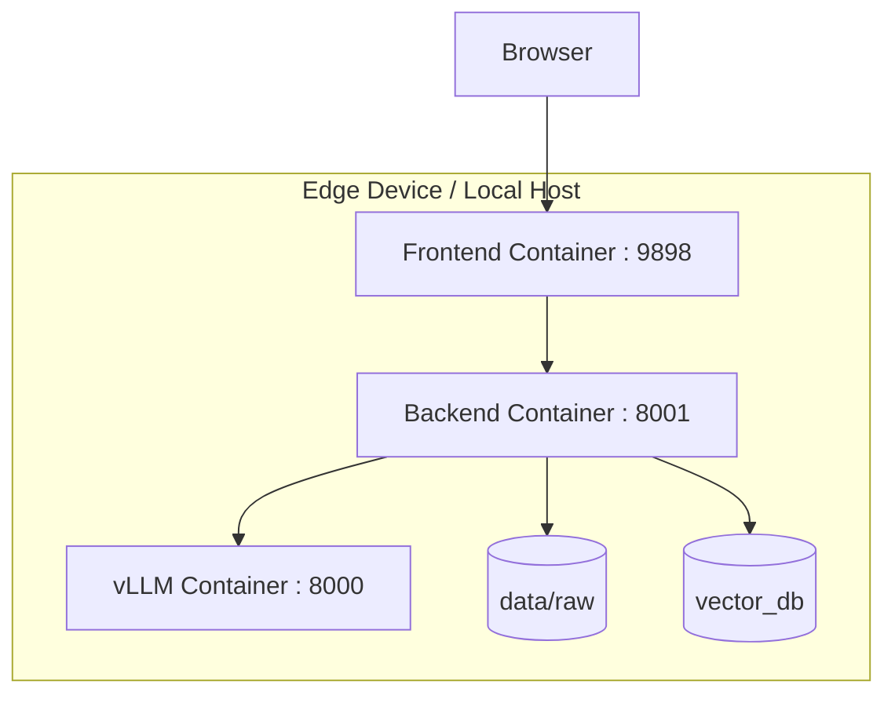
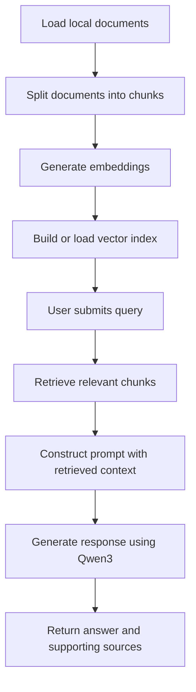
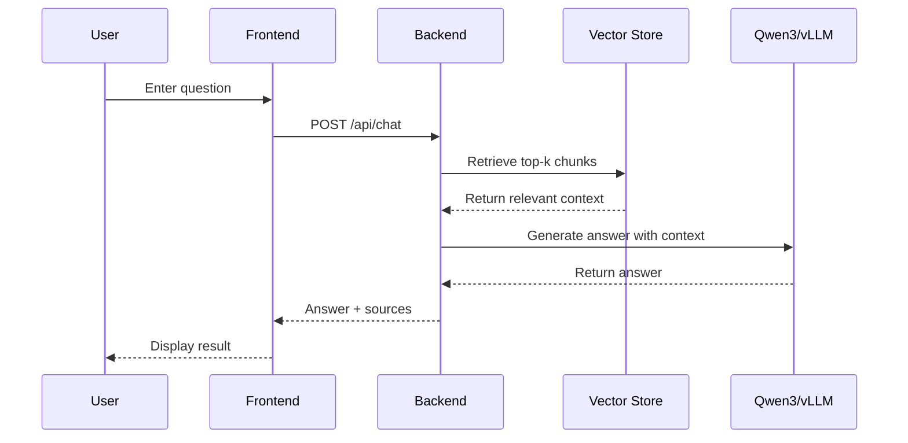

# Project Topic & Abstract

## 1. Topic of the Project

**Project Title:** Edge-Deployable Local Retrieval-Augmented Generation Question Answering System Based on Qwen3 and BGE-M3

This project proposes the design and implementation of a **local Retrieval-Augmented Generation (RAG) system** for edge-computing environments. The system is intended to answer user queries on the basis of a private local knowledge base by integrating a locally deployed Qwen3 model, a local retrieval pipeline, and a lightweight web-based interface.

---

## 2. Abstract

Although large language models are capable of producing fluent and informative responses, they are often prone to hallucination and do not inherently possess access to private or domain-specific documents. Retrieval-Augmented Generation (RAG) addresses this limitation by incorporating a retrieval stage prior to generation, thereby enabling responses to be grounded in relevant external knowledge.

This project develops a **fully local RAG system** tailored for edge deployment. The proposed system consists of a frontend for user interaction, a FastAPI-based backend for orchestration of the RAG pipeline, a local vector store for similarity-based retrieval, and a Qwen3-4B model served through vLLM for final answer generation. Local documents are ingested, segmented into manageable chunks, transformed into vector embeddings, and stored in a searchable index. When a user submits a query, the backend retrieves the most relevant document segments and supplies them to the language model as contextual evidence, thereby improving factual grounding and reducing unsupported generation.

The project demonstrates how intelligent question-answering services can be deployed locally in an edge-computing setting while preserving privacy, improving modularity, and enhancing explainability through source-aware responses.

---

## 3. Objectives of the Project

### Overarching Objective

To develop a **containerized local RAG system** capable of operating on an edge device, retrieving relevant information from local documents, and generating grounded responses using a locally deployed large language model.

### Demonstrable Goals

1. To deploy the Qwen3-4B model locally through vLLM.
2. To provide a web-based interface for interactive question answering.
3. To implement a backend RAG pipeline for document loading, text splitting, retrieval, and response generation.
4. To construct and persist a local vector index for knowledge retrieval.
5. To return generated answers together with supporting source chunks.
6. To package the entire system using Docker Compose for reproducible deployment.

---

## 4. Software Architecture and Operation of the System

### 4.1 Block Diagram

```mermaid
flowchart LR
    U[User] --> F[Frontend]
    F --> B[Backend API]
    B --> D[Local Documents]
    B --> E[Embedding Module]
    E --> V[Vector Store]
    B --> V
    B --> Q[vLLM / Qwen3]
    Q --> B
    B --> F
    F --> U
```

### 4.2 Deployment Architecture

### 4.3 System Workflow

### 4.4 UML Sequence Diagram

---

## 5. Software Modules to Be Used in the System

1. **Frontend Module**  
   Provides the web-based user interface for submitting questions, checking system status, and displaying answers.

2. **Backend API Module**  
   Manages indexing, retrieval, prompt construction, and response generation.

3. **Document Loader Module**  
   Reads local `.txt` and `.md` files from the knowledge base.

4. **Text Splitter Module**  
   Divides long documents into smaller chunks suitable for retrieval.

5. **Embedding Module**  
   Converts document chunks and user queries into vector representations. The intended model choice is **BGE-M3**.

6. **Vector Store Module**  
   Stores document vectors locally and performs similarity-based retrieval.

7. **LLM Service Module**  
   Uses **Qwen3-4B via vLLM** to generate the final response.

8. **Docker Compose Module**  
   Orchestrates the frontend, backend, and model services in a unified deployment.

---

## 6. Demonstration Scenarios of the System

### Scenario 1: System Startup
- Start all containers.
- Open the frontend page in a browser.
- Verify system and model status.

### Scenario 2: Index Construction
- Place documents into `data/raw`.
- Trigger `POST /api/index`.
- Demonstrate that the vector index is successfully built.

### Scenario 3: Question Answering
- Submit a question related to the local documents.
- Display the retrieved sources and the generated answer.

### Scenario 4: Grounded Response
- Ask a question whose answer is explicitly supported by the knowledge base.
- Demonstrate that the system returns both the answer and supporting evidence.

### Scenario 5: Out-of-Scope Query
- Submit a question not covered by the local documents.
- Demonstrate that the system does not produce a confident answer without sufficient evidence.

---

## 7. Summary

In summary, this project proposes a **local edge-deployable RAG platform** consisting of a frontend, a FastAPI backend, a local vector store, and a Qwen3 model served through vLLM. The system is designed to answer questions over private local documents while providing supporting evidence for its responses. As such, it is well suited to edge AI deployment scenarios and serves as a strong demonstration of practical AI system integration in a course project context.
