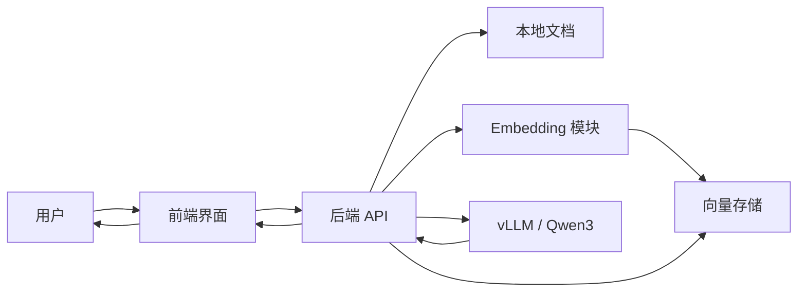
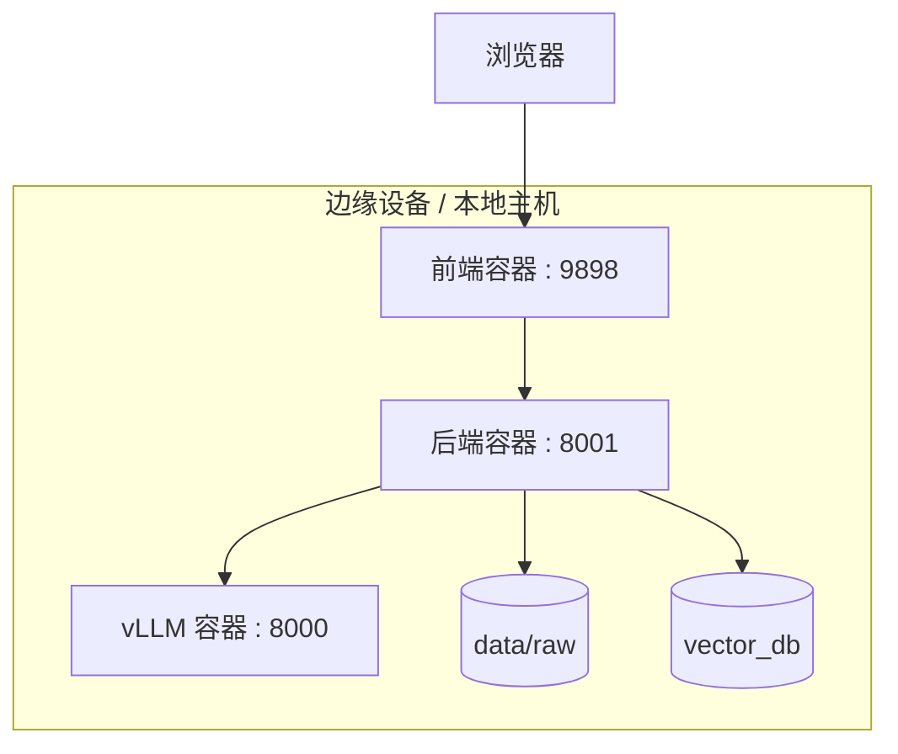
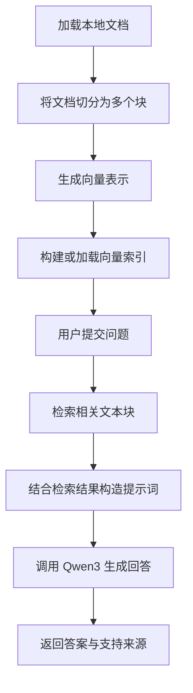
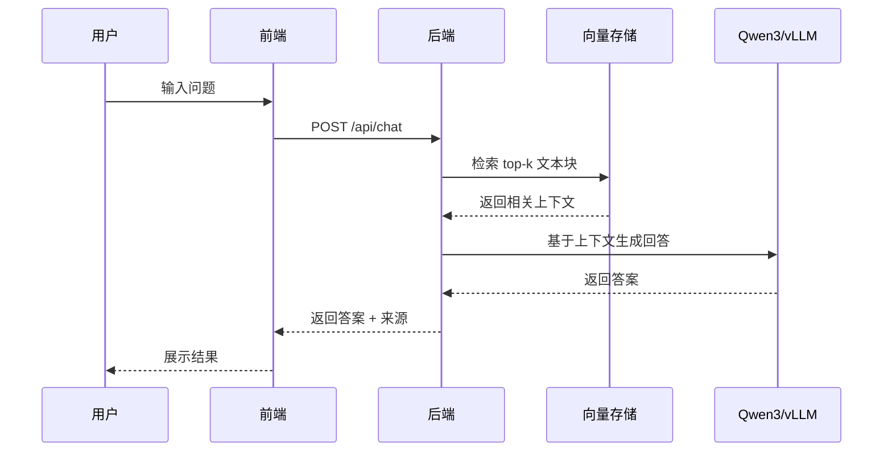

# 项目题目与摘要

## 1. 项目题目

**项目名称：** 基于 Qwen3 与 BGE-M3 的边缘端本地检索增强生成问答系统

本项目拟设计并实现一个面向边缘计算环境的**本地检索增强生成（Retrieval-Augmented Generation, RAG）系统**。该系统通过结合本地部署的 Qwen3 大语言模型、本地检索流水线以及轻量级 Web 界面，实现基于私有本地知识库的问答服务。

---

## 2. 项目摘要

尽管大语言模型能够生成流畅且信息丰富的回答，但其仍然容易产生幻觉，并且无法天然访问私有或领域专属文档。检索增强生成（RAG）通过在生成阶段之前引入检索过程，使模型能够基于相关外部知识进行回答，从而缓解上述问题。

本项目拟开发一个**完全部署在本地的 RAG 系统**，适用于边缘计算场景。系统由前端交互界面、基于 FastAPI 的后端编排服务、本地向量存储模块以及通过 vLLM 提供推理服务的 Qwen3-4B 模型组成。系统首先对本地文档进行加载、切分、向量化与索引构建；当用户提交问题后，后端会检索与问题最相关的文档片段，并将其作为上下文提供给语言模型，从而生成更具事实依据的回答，并降低无依据生成的风险。

本项目展示了智能问答服务如何在边缘计算环境下实现本地化部署，同时兼顾隐私保护、系统模块化以及回答可解释性。

---

## 3. 项目目标

### 总体目标

开发一个**容器化的本地 RAG 系统**，使其能够运行于边缘设备之上，从本地文档中检索相关信息，并借助本地部署的大语言模型生成具有依据的回答。

### 可展示目标

1. 通过 vLLM 在本地部署 Qwen3-4B 模型。
2. 提供支持交互式问答的 Web 前端界面。
3. 实现后端 RAG 流水线，包括文档加载、文本切分、检索与回答生成。
4. 构建并持久化本地向量索引。
5. 在返回答案的同时展示支持性来源片段。
6. 使用 Docker Compose 对整个系统进行统一封装与部署。

---

## 4. 系统软件架构与运行方式

### 4.1 系统框图

### 4.2 部署架构图

### 4.3 系统工作流程

### 4.4 UML 时序图

---

## 5. 系统使用的软件模块

1. **前端模块**  
   提供 Web 交互界面，用于提交问题、检查系统状态以及展示回答结果。

2. **后端 API 模块**  
   负责索引构建、检索调度、提示词构造以及回答生成。

3. **文档加载模块**  
   读取知识库中的本地 `.txt` 与 `.md` 文件。

4. **文本切分模块**  
   将长文档切分为适合检索的小文本块。

5. **向量化模块**  
   将文档块与用户问题转换为向量表示，目标模型为 **BGE-M3**。

6. **向量存储模块**  
   负责本地存储文档向量，并执行基于相似度的检索。

7. **大语言模型服务模块**  
   通过 **vLLM 部署的 Qwen3-4B** 生成最终回答。

8. **Docker Compose 编排模块**  
   统一管理前端、后端与模型服务的部署与运行。

---

## 6. 系统演示场景

### 场景 1：系统启动
- 启动所有容器服务。
- 在浏览器中打开前端页面。
- 检查系统与模型服务状态。

### 场景 2：索引构建
- 将文档放入 `data/raw`。
- 触发 `POST /api/index`。
- 展示向量索引已成功构建。

### 场景 3：问题问答
- 提交一个与本地文档相关的问题。
- 展示检索到的来源片段与最终生成答案。

### 场景 4：有依据回答
- 提出一个知识库中明确包含答案的问题。
- 展示系统不仅返回答案，也返回相应证据。

### 场景 5：超出知识库范围的问题
- 提交一个本地文档未覆盖的问题。
- 展示系统在缺乏足够依据时不会给出高置信度回答。

---

## 7. 总结

综上，本项目提出了一个**可部署在边缘端的本地 RAG 平台**，其核心组成包括前端界面、FastAPI 后端、本地向量存储以及通过 vLLM 提供服务的 Qwen3 模型。该系统旨在对私有本地文档进行问答，并同时提供支持性证据，因此非常适合作为边缘 AI 部署与课程项目展示的实践案例。
