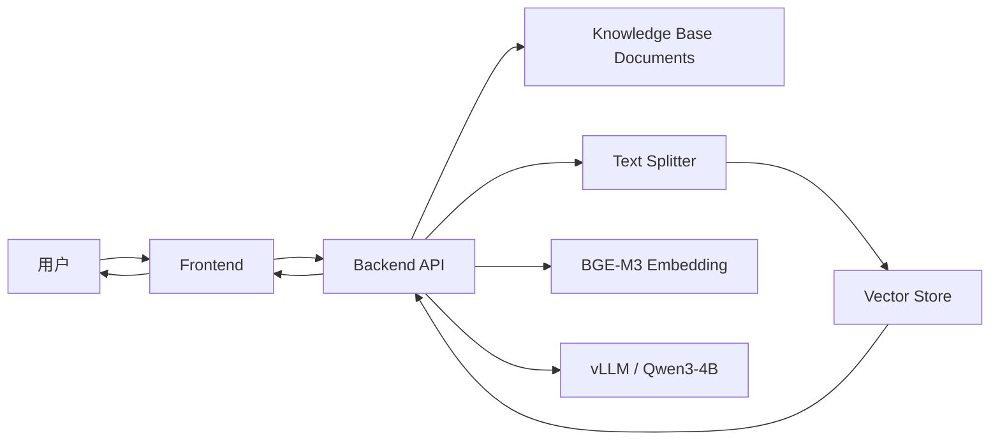
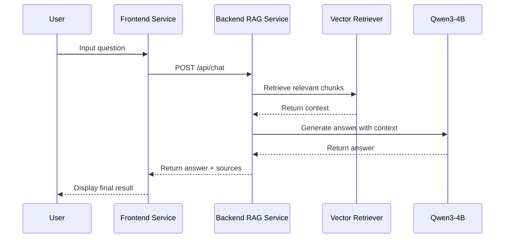

# 基于 LangChain + Qwen3 + BGE-M3 的本地 RAG 系统

## Project Overview

本项目在 `finalProject/` 中实现一个**基于 Docker 组织形式的本地 RAG 系统**，整体组织方式参考 `Project/Gomoku/README.md` 与 `Lab3/README.md`：

- 根目录负责容器编排与模型启动脚本
- `src/backend/` 负责后端 RAG 服务
- `src/frontend/` 负责前端页面与交互逻辑
- **Qwen3-4B** 按照 Lab3 的方式，通过 **vLLM 容器服务** 提供模型能力
- **BGE-M3** 作为 embedding 模型
- **LangChain** 作为整体设计思路参考，用于组织 RAG 链路

当前项目已经完成第一版骨架实现，目标是实现以下完整流程：

- 用户在前端输入问题
- 前端调用后端接口
- 后端完成文档加载、切分、检索与回答生成
- 后端通过 OpenAI-compatible API 调用本地 Qwen3
- 前端展示答案与检索来源

---

## 方案可行性

这个项目改成类似 Gomoku 的 Docker 结构是**可行的，而且更适合课程展示**。

原因如下：

1. **结构清晰**：根目录负责部署，`src/` 负责业务代码
2. **便于容器化**：前端、后端、vLLM 可以统一由 `docker-compose.yaml` 管理
3. **便于答辩讲解**：可以清楚说明“前端服务 + 后端服务 + 模型服务”三层关系
4. **便于扩展**：后续可以替换 embedding 实现、增加 PDF 支持、增加多轮对话

---

## 整体架构

本项目采用**前后端分离 + 独立模型服务**的结构：

- **Frontend**：负责界面展示与用户交互
- **Backend**：负责 RAG 主链路
- **vLLM(Qwen3)**：负责最终回答生成
- **Vector DB**：负责本地检索索引



---

## Project Structure

```text
finalProject/
├── README.md                    # This document
├── docker-compose.yaml          # Container orchestration
├── start_vllm.sh                # Start local vLLM service for Qwen3
├── stop_vllm.sh                 # Stop local vLLM service
├── .env.example                 # Environment variable example
│
├── src/
│   ├── backend/                 # Backend RAG service
│   │   ├── app.py               # FastAPI application entry
│   │   ├── config.py            # Configuration management
│   │   ├── rag_chain.py         # RAG pipeline
│   │   ├── loader.py            # Document loading
│   │   ├── splitter.py          # Text splitting
│   │   ├── vector_store.py      # Local vector store
│   │   ├── embedding_client.py  # BGE-M3 wrapper (current simplified impl)
│   │   ├── llm_client.py        # Qwen3 client (OpenAI-compatible)
│   │   ├── prompt.py            # Prompt template
│   │   ├── requirements.txt     # Python dependencies
│   │   └── Dockerfile           # Backend container image
│   │
│   └── frontend/                # Frontend service
│       ├── index.html           # Main interface
│       ├── style.css            # Styles
│       ├── app.js               # Frontend logic
│       └── Dockerfile           # Frontend container image
│
├── data/
│   ├── raw/                     # Original knowledge base documents
│   └── processed/               # Optional processed files
│
├── vector_db/                   # Local vector database persistence
│
└── tests/                       # Test module
    ├── __init__.py
    ├── test_loader.py           # Document loading tests
    ├── test_splitter.py         # Splitting tests
    ├── test_retriever.py        # Retrieval tests
    ├── test_api.py              # API tests
    └── test_integration.py      # End-to-end tests
```

---

## 前端与后端职责划分

## Frontend

### Responsibilities

- 提供问题输入框
- 调用后端 API
- 展示模型回答
- 展示检索来源
- 展示索引构建和系统状态

### Tech Stack

- `HTML`
- `CSS`
- `Vanilla JavaScript`

### Port

- `9898`

### 当前页面功能

- 检查系统状态
- 构建索引
- 提交问题
- 展示回答
- 展示 sources

---

## Backend

### Responsibilities

- 提供 HTTP API
- 加载本地知识库文档
- 切分文本
- 生成 embedding
- 建立并读取本地向量索引
- 执行相似度检索
- 调用本地 Qwen3-4B 生成回答
- 将最终结果返回前端

### Tech Stack

- `FastAPI`
- `httpx`
- 本地向量检索实现
- OpenAI-compatible Qwen3 API

### Port

- `8001`

---

## Backend Module Design

### Module 1: Document Loader

**Responsibilities:**
- 读取 `data/raw/` 中的知识库文档
- 当前支持 `txt` 与 `md`
- 转换为统一的文档对象

---

### Module 2: Text Splitter

**Responsibilities:**
- 将长文档切分为多个 chunk
- 保留 overlap 以提升上下文连续性

**Current Parameters:**
- `chunk_size = 500`
- `chunk_overlap = 100`

---

### Module 3: Embedding Layer

**Responsibilities:**
- 对文档块与用户问题做向量化
- 当前版本使用简化的本地 embedding 实现作为占位
- 后续可替换为真实 **BGE-M3** 模型推理

**说明：**
README 保留 BGE-M3 作为正式方案；当前代码中的 `embedding_client.py` 是一个可测试、可运行的轻量实现，便于先打通项目链路。

---

### Module 4: Vector Store

**Responsibilities:**
- 存储文档 embedding
- 提供持久化能力
- 支持相似度检索

**Current Implementation:**
- 本地 JSON 持久化
- 余弦相似度检索

**Future Options:**
- `Chroma`
- `FAISS`

---

### Module 5: LLM Integration

**Responsibilities:**
- 通过 OpenAI-compatible API 调用本地 Qwen3-4B
- 基于检索结果生成最终回答

**Connection Strategy:**
- 参考 `Lab3` 的服务定义，将 Qwen3 作为独立的 `vllm` 容器运行
- 镜像：`ghcr.io/nvidia-ai-iot/vllm:latest-jetson-orin`
- 端口：`8000`
- 服务角色：`Qwen3-4B language model`
- 后端访问地址：
  - 容器内：`http://vllm:8000/v1`
  - 宿主机调试：`http://localhost:8000/v1`

**Prompt Design:**

```text
你是一个基于本地知识库进行问答的助手。
请严格依据提供的上下文回答用户问题。
如果上下文中没有足够信息，请明确说明“我无法从当前知识库中找到足够依据”。
不要编造事实。

上下文：
{context}

问题：
{question}
```

---

## API Specification

### `GET /`

后端根路径，返回服务状态说明。

### `GET /api/health`

健康检查。

```json
{"status": "ok"}
```

### `GET /api/status`

检查后端、索引和模型服务状态。

```json
{
  "backend": true,
  "index_ready": true,
  "qwen_ready": true,
  "embedding_ready": true
}
```

### `POST /api/index`

构建或重建知识库索引。

```json
{
  "status": "ok",
  "message": "Index built successfully",
  "documents": 2,
  "chunks": 4,
  "index_ready": true
}
```

### `POST /api/chat`

用户提问并获取回答。

```json
// Request
{"question": "什么是 RAG？"}
```

```json
// Response
{
  "answer": "RAG 是一种将检索与生成结合的问答方法。",
  "sources": [
    {
      "source": "intro.md",
      "content": "RAG combines retrieval and generation...",
      "score": 0.82
    }
  ]
}
```

### `GET /ui`

返回前端页面文件（若存在）。

---

## Workflow



---

## Docker / Qwen3 Connection Configuration

Qwen3 的连接配置参考 `Lab3/README.md`：

| Service | Image | Port | Description |
|---------|-------|------|-------------|
| LLM (vLLM) | `ghcr.io/nvidia-ai-iot/vllm:latest-jetson-orin` | 8000 | Qwen3-4B language model |

也就是说，在本项目中，Qwen3 推荐继续作为一个独立的 `vllm` 服务运行，由后端通过 OpenAI-compatible API 访问。

---

## Deployment

### 1. Start vLLM Service (Qwen3-4B)

可以使用根目录脚本启动：

```bash
cd finalProject
bash start_vllm.sh
curl -s http://localhost:8000/v1/models
```

停止：

```bash
bash stop_vllm.sh
```

**Recommended vLLM service definition:**

```yaml
services:
  vllm:
    image: ghcr.io/nvidia-ai-iot/vllm:latest-jetson-orin
    shm_size: "8g"
    ulimits:
      memlock: -1
      stack: 67108864
    runtime: nvidia
    volumes:
      - /opt/models/Qwen3-4B-quantized.w4a16:/root/.cache/huggingface/Qwen3-4B-quantized.w4a16
    command: >
      vllm serve /root/.cache/huggingface/Qwen3-4B-quantized.w4a16
        --host 0.0.0.0
        --port 8000
        --gpu-memory-utilization 0.40
        --max-model-len 4096
        --max-num-batched-tokens 2048
```

---

### 2. Start Backend Service

```bash
cd finalProject/src/backend
pip install -r requirements.txt
python -m uvicorn app:app --host 0.0.0.0 --port 8001
```

---

### 3. Start Frontend Service

当前前端是一个静态页面，不需要 `npm install` 或前端框架开发服务器。进入前端目录后，使用 Python 启动一个静态文件服务即可：

```bash
cd finalProject/src/frontend
python -m http.server 9898
```

启动后，在浏览器访问：

```text
http://localhost:9898
```

如果前端页面已经启动，它会通过 `app.js` 调用后端接口，因此请确保后端已经运行在 `8001` 端口。

此外，如果不想单独启动静态服务，也可以直接访问后端提供的页面入口：

```text
http://localhost:8001/ui
```

---

### 4. 通过Docker Compose快速启动和停止

本项目推荐参考 `Lab3/docker-compose.yml` 的写法，把 **vllm + backend + frontend** 一起放入 compose 中统一管理。

```yaml
services:
  vllm:
    image: ghcr.io/nvidia-ai-iot/vllm:latest-jetson-orin
    shm_size: "8g"
    ulimits:
      memlock: -1
      stack: 67108864
    runtime: nvidia
    volumes:
      - /opt/models/Qwen3-4B-quantized.w4a16:/root/.cache/huggingface/Qwen3-4B-quantized.w4a16
    command: >
      vllm serve /root/.cache/huggingface/Qwen3-4B-quantized.w4a16
        --host 0.0.0.0
        --port 8000
        --gpu-memory-utilization 0.40
        --max-model-len 4096
        --max-num-batched-tokens 2048

  backend:
    build:
      context: ./src/backend
      dockerfile: Dockerfile
    ports:
      - "8001:8001"
    environment:
      - QWEN_BASE_URL=http://vllm:8000/v1
      - VECTOR_DB_DIR=/app/vector_db
      - DATA_DIR=/app/data/raw
    volumes:
      - ./data:/app/data
      - ./vector_db:/app/vector_db
    depends_on:
      - vllm

  frontend:
    build:
      context: ./src/frontend
      dockerfile: Dockerfile
    ports:
      - "9898:9898"
    depends_on:
      - backend
```

启动：

```bash
cd finalProject
docker compose up --build
```

停止：

```bash
docker compose down
```

---

## Configuration

### Environment Variables

| Variable | Default | Description |
|----------|---------|-------------|
| `QWEN_BASE_URL` | `http://vllm:8000/v1` | Qwen3 API address inside docker compose |
| `QWEN_MODEL` | `/root/.cache/huggingface/Qwen3-4B-quantized.w4a16` | Model name |
| `EMBEDDING_MODEL_PATH` | `/opt/models/bge-m3` | Local BGE-M3 path |
| `VECTOR_DB_DIR` | `./vector_db` | Vector DB directory |
| `DATA_DIR` | `./data/raw` | Knowledge base directory |
| `TOP_K` | `3` | Number of retrieved chunks |
| `BACKEND_HOST` | `0.0.0.0` | Backend host |
| `BACKEND_PORT` | `8001` | Backend service port |
| `FRONTEND_PORT` | `9898` | Frontend service port |
| `VLLM_IMAGE` | `ghcr.io/nvidia-ai-iot/vllm:latest-jetson-orin` | vLLM container image |

可以参考 `.env.example`。

---

## Testing

### Running Tests

建议在你的 `qwen3` conda 环境中运行测试。

```bash
cd finalProject
python -m pytest tests/ -v
```

### Current Test Files

| Test File | Focus |
|----------|-------|
| `test_loader.py` | 文档加载 |
| `test_splitter.py` | 文本切分 |
| `test_retriever.py` | 检索逻辑 |
| `test_api.py` | API 行为 |
| `test_integration.py` | 端到端问答流程 |

### Current Status

当前项目测试已通过第一版验证，适合作为课程项目基础版本继续增强。

---

## 当前实现说明

虽然 README 的设计目标是 **LangChain + Qwen3 + BGE-M3**，但当前代码为了先完成项目闭环，采用了以下策略：

- 保留 LangChain/BGE-M3/Qwen3 的整体架构设计
- 当前 `embedding_client.py` 是一个简化实现，用于先打通检索主链路
- 当前 `vector_store.py` 是轻量本地实现，用于先完成可测试的最小版本
- Qwen3 连接方式已经按照 vLLM/OpenAI-compatible API 的方式设计好

这意味着：

- **当前版本适合演示系统结构与最小可运行链路**
- **后续可以逐步把 embedding 和 vector store 替换为真实生产级组件**

---

## Recommended Next Steps

### Phase 1
继续完成真实联调：
- 启动 vLLM
- 调用 `/api/index`
- 调用 `/api/chat`
- 验证和本地 Qwen3 连通

### Phase 2
将当前简化实现替换为：
- 真实 `BGE-M3` embedding
- 真实 `LangChain` 组织链路
- 真实 `Chroma` / `FAISS`

### Phase 3
增强交互与可展示性：
- 更丰富的前端 UI
- 文档上传
- 多轮对话
- 检索来源高亮

---

## Summary

把 `finalProject` 改成 `Project/Gomoku/README.md` 那种 Docker 风格组织，**是可行的，而且已经完成了第一版实现**。

新的核心思路是：

- 根目录负责部署与编排
- `src/backend/` 负责 RAG 核心逻辑
- `src/frontend/` 负责问答界面
- Qwen3 按 Lab3 的方式通过 `vllm` 容器服务提供模型能力
- 后续如有需要，再决定是否把 embedding 服务继续拆分

完整链路可以概括为：

**Frontend → Backend API → Retriever / Vector DB → Qwen3 → Frontend**

从课程项目角度看，这种设计的优点是：

- 架构更规范
- 前后端职责明确
- 便于 Docker 部署
- 易于演示与答辩
- 便于后续继续扩展
